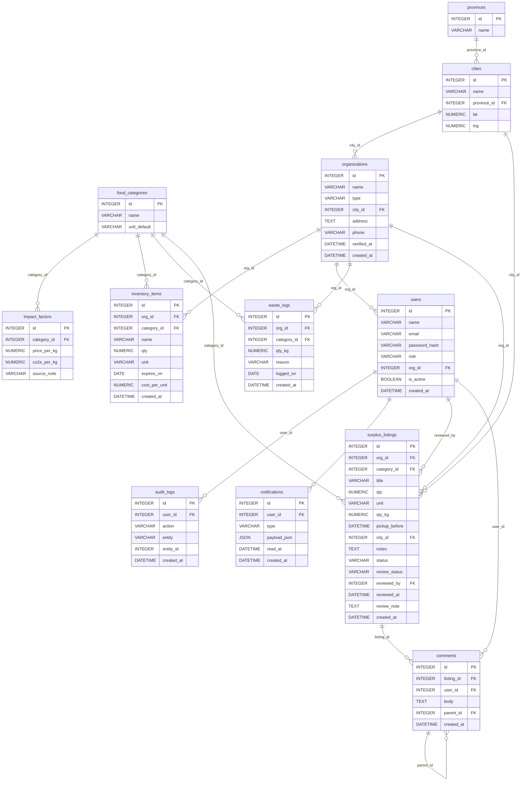

# ERD FoodLoop ID

Diagram dibuat otomatis dari model SQLAlchemy (12 tabel).

```mermaid
erDiagram
    provinces ||--o{ cities : "province_id"
    food_categories ||--o{ impact_factors : "category_id"
    cities ||--o{ organizations : "city_id"
    organizations ||--o{ inventory_items : "org_id"
    food_categories ||--o{ inventory_items : "category_id"
    organizations ||--o{ users : "org_id"
    organizations ||--o{ waste_logs : "org_id"
    food_categories ||--o{ waste_logs : "category_id"
    users ||--o{ audit_logs : "user_id"
    users ||--o{ notifications : "user_id"
    users ||--o{ surplus_listings : "reviewed_by"
    food_categories ||--o{ surplus_listings : "category_id"
    cities ||--o{ surplus_listings : "city_id"
    organizations ||--o{ surplus_listings : "org_id"
    surplus_listings ||--o{ comments : "listing_id"
    comments ||--o{ comments : "parent_id"
    users ||--o{ comments : "user_id"
    food_categories {
        INTEGER id PK
        VARCHAR name
        VARCHAR unit_default
    }
    provinces {
        INTEGER id PK
        VARCHAR name
    }
    cities {
        INTEGER id PK
        VARCHAR name
        INTEGER province_id FK
        NUMERIC lat
        NUMERIC lng
    }
    impact_factors {
        INTEGER id PK
        INTEGER category_id FK
        NUMERIC price_per_kg
        NUMERIC co2e_per_kg
        VARCHAR source_note
    }
    organizations {
        INTEGER id PK
        VARCHAR name
        VARCHAR type
        INTEGER city_id FK
        TEXT address
        VARCHAR phone
        DATETIME verified_at
        DATETIME created_at
    }
    inventory_items {
        INTEGER id PK
        INTEGER org_id FK
        INTEGER category_id FK
        VARCHAR name
        NUMERIC qty
        VARCHAR unit
        DATE expires_on
        NUMERIC cost_per_unit
        DATETIME created_at
    }
    users {
        INTEGER id PK
        VARCHAR name
        VARCHAR email
        VARCHAR password_hash
        VARCHAR role
        INTEGER org_id FK
        BOOLEAN is_active
        DATETIME created_at
    }
    waste_logs {
        INTEGER id PK
        INTEGER org_id FK
        INTEGER category_id FK
        NUMERIC qty_kg
        VARCHAR reason
        DATE logged_on
        DATETIME created_at
    }
    audit_logs {
        INTEGER id PK
        INTEGER user_id FK
        VARCHAR action
        VARCHAR entity
        INTEGER entity_id
        DATETIME created_at
    }
    notifications {
        INTEGER id PK
        INTEGER user_id FK
        VARCHAR type
        JSON payload_json
        DATETIME read_at
        DATETIME created_at
    }
    surplus_listings {
        INTEGER id PK
        INTEGER org_id FK
        INTEGER category_id FK
        VARCHAR title
        NUMERIC qty
        VARCHAR unit
        NUMERIC qty_kg
        DATETIME pickup_before
        INTEGER city_id FK
        TEXT notes
        VARCHAR status
        VARCHAR review_status
        INTEGER reviewed_by FK
        DATETIME reviewed_at
        TEXT review_note
        DATETIME created_at
    }
    comments {
        INTEGER id PK
        INTEGER listing_id FK
        INTEGER user_id FK
        TEXT body
        INTEGER parent_id FK
        DATETIME created_at
    }
```